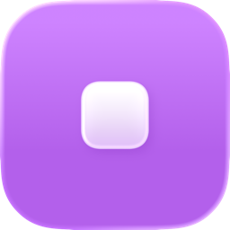
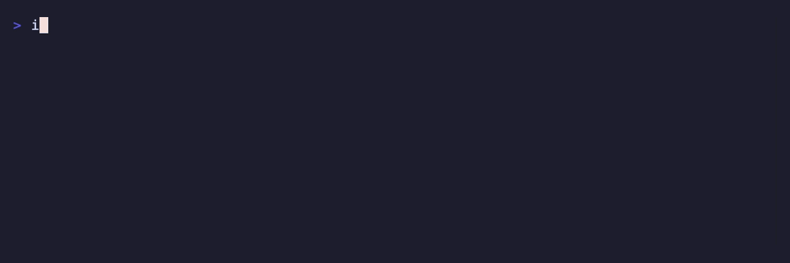

<p align="center">
  
  <h1 align="center">icn</h1>
  <p align="center">Generate .icon and .png files from SF Symbols</p>
</p>

<p align="center">
  <a href="https://github.com/Aayush9029/icn/releases/latest"></a>
  <a href="https://github.com/Aayush9029/icn/blob/main/LICENSE"></a>
</p>

<p align="center">
  
</p>

## Install

```bash
brew install aayush9029/tap/icn
```

Or tap first:

```bash
brew tap aayush9029/tap
brew install icn
```

## Usage

```bash
icn                                                  # interactive mode
icn swift --color blue                               # SF Symbol with auto gradient
icn heart.fill --color "#FF3B30" --fill solid --glass # solid red with glass effect
icn star.fill --name MyAppIcon --color orange         # custom name
icn swift --color white --symbol-color black          # override symbol color
icn swift --color blue --glass --png                  # export PNG
icn swift --color blue --glass --png --rendition dark # dark mode
icn swift --color blue --png --platform macos          # macOS platform
```

## Options

| Flag | Description |
|------|-------------|
| `<symbol>` | SF Symbol name (e.g. `swift`, `heart.fill`) |
| `-c, --color` | Background color — hex or name |
| `-f, --fill` | `solid` \| `gradient` \| `linear` (default: `gradient`) |
| `--symbol-color` | Symbol foreground color (default: auto) |
| `-g, --glass` | Enable glass effect |
| `-s, --scale` | Symbol scale (default: 0.57, glass: 0.63) |
| `--png` | Export composited PNG |
| `--platform` | `ios` \| `macos` \| `watchos` (default: `ios`) |
| `--rendition` | `default` \| `dark` \| `tinted-dark` |

## License

MIT
